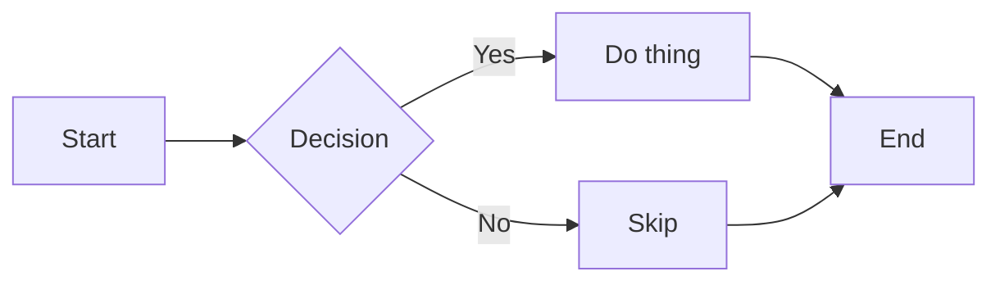
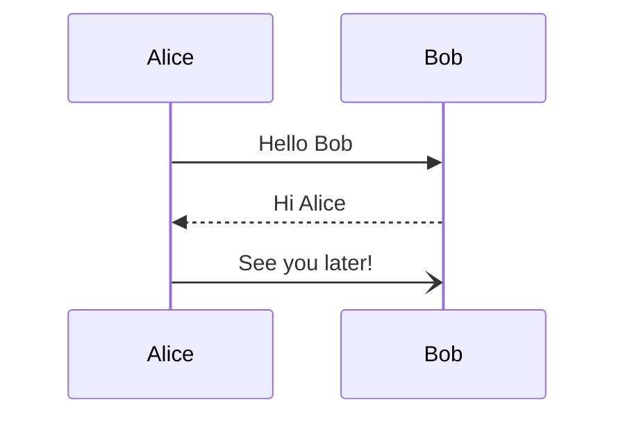
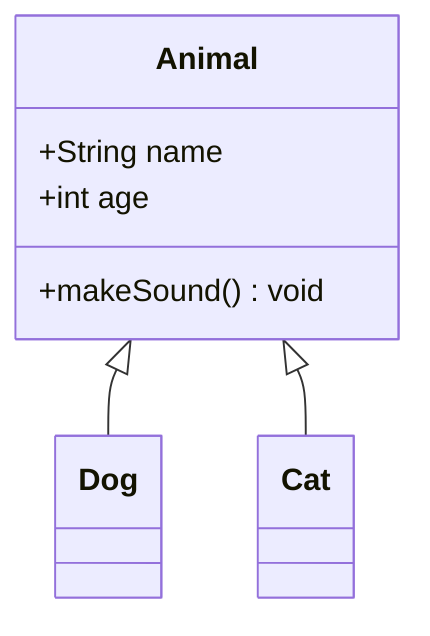
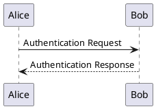
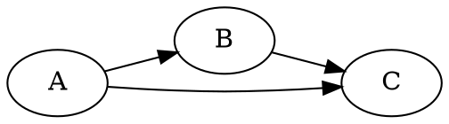

# Unsupported Syntax Showcase

This fixture collects every Markdown feature listed as **missing** or **partial** in
`docs/MARKDOWN_FEATURE_COVERAGE.md`. Use it to verify what termdown renders today and
as a regression fixture as features are added.

The YAML frontmatter above should be hidden by the renderer. Currently it leaks into
the rendered output.

## 1. HTML blocks and inline HTML

A raw HTML block:

<div style="padding: 8px; border: 1px solid #ccc;">
  <strong>Hello</strong> from inline HTML.
</div>

Inline HTML in a paragraph: this word is <u>underlined via HTML</u> and this one is
<span style="color: red">red via HTML</span>. An inline <br/> break and an
<abbr title="HyperText Markup Language">HTML</abbr> abbreviation.

An HTML comment: <!-- this comment should not appear --> end of line.

## 2. GFM autolinks (bare URLs)

Bare URL: https://example.com/docs/readme.html
Bare email: support@example.com
URL in text: visit https://github.com/rrbe/termdown for the source.

## 3. GFM alerts / admonitions

> [!NOTE]
> Useful information that users should know, even when skimming content.

> [!TIP]
> Helpful advice for doing things better or more easily.

> [!IMPORTANT]
> Key information users need to know to achieve their goal.

> [!WARNING]
> Urgent info that needs immediate user attention to avoid problems.

> [!CAUTION]
> Advises about risks or negative outcomes of certain actions.

## 4. Footnotes

Here is a sentence with a footnote.[^1] And another one.[^longnote]

Inline footnote: text with an inline footnote.^[This is an inline footnote body.]

[^1]: This is the first footnote body.
[^longnote]: This footnote has **bold**, `code`, and multiple

    paragraphs. It should render as a numbered reference in the main text,
    with the body collected at the bottom of the document.

## 5. Math (LaTeX)

Inline math: the Pythagorean theorem says $a^2 + b^2 = c^2$.

Display math:

$$
\int_{-\infty}^{\infty} e^{-x^2} \, dx = \sqrt{\pi}
$$

A matrix:

$$
A = \begin{pmatrix} 1 & 2 \\ 3 & 4 \end{pmatrix}
$$

## 6. Definition list

Term 1
: Definition of term 1.

Term 2
: First paragraph of the definition.

    Second paragraph of the definition, indented.

Apple
: A red or green fruit.

Orange
: A citrus fruit with a tough rind.

## 7. Smart punctuation

Straight quotes that should become curly: "Hello," she said. 'Yes,' he replied.
Ellipsis from three dots... and an em-dash -- like this, and an en-dash -- too.

## 8. Wikilinks

Reference a page with [[WikiLink]] syntax, and with an alias like
[[Target Page|the display text]].

## 9. Subscript and superscript

Water is H~2~O and Einstein said E=mc^2^. Also 10^th^ and x~n+1~.

## 10. Mermaid diagrams

A flowchart:



A sequence diagram:



A class diagram:



## 11. PlantUML / Graphviz





## 12. Code block with language (no highlighting today)

```rust
fn main() {
    let greeting = "Hello, termdown!";
    println!("{}", greeting);
}
```

```python
def fib(n: int) -> int:
    a, b = 0, 1
    for _ in range(n):
        a, b = b, a + b
    return a
```

```json
{
  "name": "termdown",
  "features": ["headings", "tables", "tasklists"],
  "version": "0.2.0"
}
```

## 13. Images (placeholder vs real render)

Local image (does not exist, exercises error path):


Remote image:


Reference-style image:

![ref image][banner]

[banner]: https://example.com/banner.png "Banner title"

## 14. Emoji shortcodes

Shortcodes like :smile:, :rocket:, :tada: should ideally become 😄 🚀 🎉.
Unicode emoji themselves work fine: 😄 🚀 🎉.

## 15. Tables with advanced alignment

| Left | Center | Right |
| :--- | :----: | ----: |
| a    |   b    |     c |
| long left content | center | 1 |
| x    | **bold** in cell | `code` |

## End

If every section above renders with rich formatting, termdown has full coverage of the
audited feature set.
