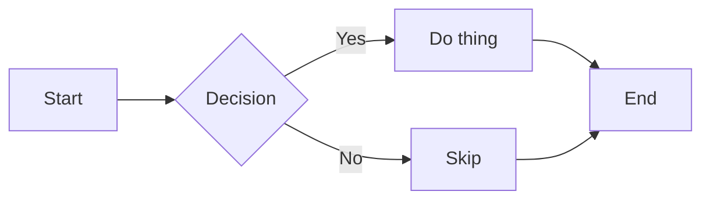
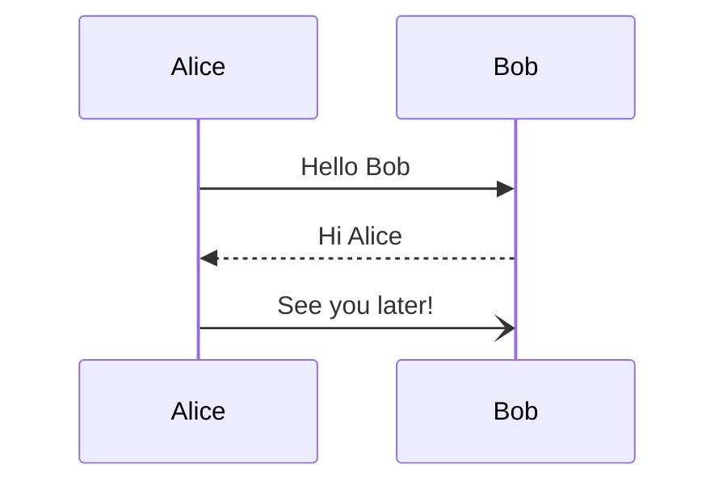
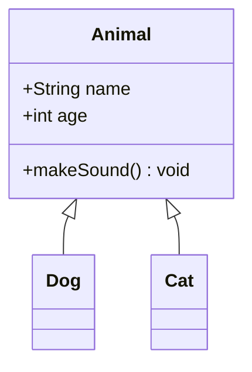
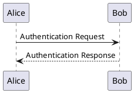
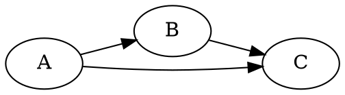

# Unsupported Syntax Showcase

This fixture collects Markdown features termdown does **not** plan to support, or
treats as out-of-scope. It exists to lock the current "graceful degradation"
rendering as a snapshot — so if rendering accidentally improves or regresses for
one of these, the snapshot will diff.

Features that are on the **roadmap** (HTML tags, images, markdown frontmatter,
long-text wrap & indent) live in `supported-syntax.md`, not here.

## 1. GFM autolinks (bare URLs)

Bare URL: https://example.com/docs/readme.html
Bare email: support@example.com
URL in text: visit https://github.com/rrbe/termdown for the source.

## 2. GFM alerts / admonitions

> [!NOTE]
> Useful information that users should know, even when skimming content.

> [!TIP]
> Helpful advice for doing things better or more easily.

> [!IMPORTANT]
> Key information users need to know to achieve their goal.

> [!WARNING]
> Urgent info that needs immediate user attention to avoid problems.

> [!CAUTION]
> Advises about risks or negative outcomes of certain actions.

## 3. Footnotes

Here is a sentence with a footnote.[^1] And another one.[^longnote]

Inline footnote: text with an inline footnote.^[This is an inline footnote body.]

[^1]: This is the first footnote body.
[^longnote]: This footnote has **bold**, `code`, and multiple

    paragraphs. It should render as a numbered reference in the main text,
    with the body collected at the bottom of the document.

## 4. Math (LaTeX)

Inline math: the Pythagorean theorem says $a^2 + b^2 = c^2$.

Display math:

$$
\int_{-\infty}^{\infty} e^{-x^2} \, dx = \sqrt{\pi}
$$

A matrix:

$$
A = \begin{pmatrix} 1 & 2 \\ 3 & 4 \end{pmatrix}
$$

## 5. Definition list

Term 1
: Definition of term 1.

Term 2
: First paragraph of the definition.

    Second paragraph of the definition, indented.

Apple
: A red or green fruit.

Orange
: A citrus fruit with a tough rind.

## 6. Smart punctuation

Straight quotes that should become curly: "Hello," she said. 'Yes,' he replied.
Ellipsis from three dots... and an em-dash -- like this, and an en-dash -- too.

## 7. Wikilinks

Reference a page with [[WikiLink]] syntax, and with an alias like
[[Target Page|the display text]].

## 8. Subscript and superscript

Water is H~2~O and Einstein said E=mc^2^. Also 10^th^ and x~n+1~.

## 9. Mermaid diagrams

A flowchart:



A sequence diagram:



A class diagram:



## 10. PlantUML / Graphviz





## 11. Code block syntax highlighting

Fenced blocks with a language tag are recognized but the contents are not
syntax-highlighted today — only the structure is preserved.

```python
def fib(n: int) -> int:
    a, b = 0, 1
    for _ in range(n):
        a, b = b, a + b
    return a
```

```json
{
  "name": "termdown",
  "features": ["headings", "tables", "tasklists"],
  "version": "0.2.0"
}
```

## 12. Emoji shortcodes

Shortcodes like :smile:, :rocket:, :tada: should ideally become 😄 🚀 🎉.
Unicode emoji themselves work fine: 😄 🚀 🎉.

## End

If every section above renders with at least *some* graceful fallback,
termdown is degrading correctly on out-of-scope syntax.
